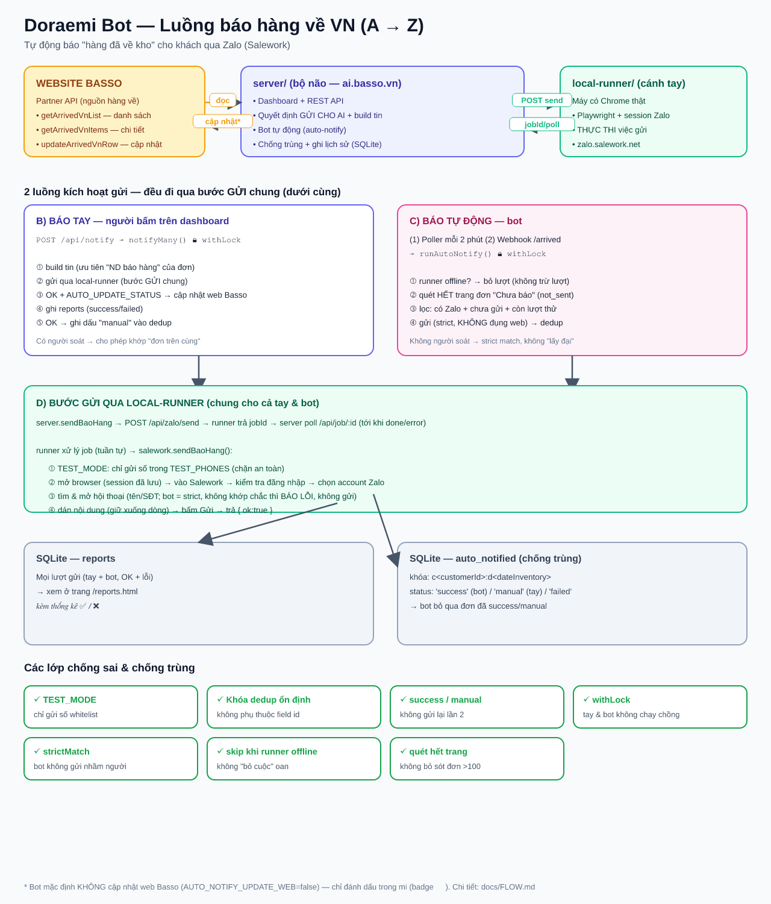

# Doraemi Bot — Toàn bộ luồng hoạt động (A → Z)

Tài liệu mô tả end-to-end cách hệ thống báo hàng về VN qua Zalo (Salework) hoạt động,
gồm cả **báo tay** và **báo tự động**. Xem thêm tổng quan ở [`README.md`](../README.md).



> Ảnh được sinh tự động từ [`scripts/gen-flow-diagram.js`](../scripts/gen-flow-diagram.js)
> (chạy `node scripts/gen-flow-diagram.js` để cập nhật `flow.png`/`flow.svg`).

---

## 0. Hai thành phần (2 process tách nhau)

```
┌─────────────────────────────┐         HTTP          ┌──────────────────────────────┐
│  server/  (deploy ai.basso) │ ── x-api-key ───────▶ │ local-runner/ (máy có Chrome) │
│  • Dashboard + API          │                       │ • Playwright (trình duyệt thật)│
│  • Đọc Basso, lưu SQLite    │ ◀── jobId / kết quả ── │ • Giữ session đăng nhập Zalo   │
│  • Bot tự động (auto-notify)│                       │ • Điều khiển zalo.salework     │
└─────────────────────────────┘                       └──────────────────────────────┘
```

- **server**: bộ não — giao diện, gọi Basso API, quyết định gửi cho ai, chống trùng, ghi lịch sử.
- **local-runner**: cánh tay — chạy trên máy có Chrome thật, giữ đăng nhập Salework/Zalo, thực thi
  việc gửi. Tách ra để session đăng nhập không bị chặn và giữ lâu dài.
- Giao tiếp: server `POST` lệnh → runner trả `jobId` ngay → server **poll** `GET /api/job/:id`
  tới khi xong (tránh timeout qua tunnel). Bảo vệ bằng header `x-api-key`.

---

## 1. Nguồn dữ liệu & nơi lưu

| Loại | Ở đâu | Ghi chú |
|---|---|---|
| Danh sách hàng về | **Basso API** `getArrivedVnList` | đọc realtime, không cache (trừ token ~1h) |
| Chi tiết SP từng đơn | Basso API `getArrivedVnItems` | load lazy khi mở rộng dòng |
| Lịch sử báo (mọi lượt gửi) | **SQLite** bảng `reports` | tay + bot đều ghi |
| Dấu chống trùng | **SQLite** bảng `auto_notified` | khóa `c<customerId>:d<dateInventory>`, status `success`/`manual`/`failed` |

> Nếu chưa cấu hình `BASSO_API_BASE_URL` → chạy **MOCK** (`server/mock/orders.json`).

**Khi nào mi đọc dữ liệu từ Basso?** Realtime, theo 2 nhịp độc lập:
- **Dashboard**: khi mở trang / bấm "Đồng bộ ngay" / đổi filter / sau khi gửi. *Không* tự refresh theo giờ.
- **Bot**: mỗi `AUTO_NOTIFY_INTERVAL_MS` (mặc định 2 phút), hoặc ngay khi webhook được gọi.

---

## 2. FLOW A — Xem danh sách hàng về (dashboard)

```
Mở trang / "Đồng bộ ngay" / đổi filter / sau khi gửi
        │
        ▼
GET /api/orders  ──▶ bassoApi.getOrders() ──▶ Basso getArrivedVnList
        │                                       (lọc status/staff/ngày/tìm kiếm)
        ▼
server gắn thêm cờ autoNotified (tra bảng dedup theo autoKey)
        │
        ▼
Dashboard render bảng: trạng thái web + badge 🤖/✋ + nút thao tác
```

→ Bot gửi ngầm dưới nền thì phải bấm **"Đồng bộ ngay"** mới thấy badge cập nhật
(badge runner poll mỗi 15s nhưng đó là tình trạng runner, không phải bảng đơn).

---

## 3. FLOW B — Báo TAY (người bấm)

```
Dashboard: chọn 1 đơn (📣) hoặc "Báo hàng loạt"
        │  (bulk tự loại đơn đã báo: web done HOẶC autoNotified success/manual)
        ▼
POST /api/notify { orderIds[], messageOverride?, kind }
        │
        ▼
notifyMany()  ──🔒 withLock (R6: không chạy chồng với bot)
        │
        └─ mỗi đơn ▶ notifyOne():
             ① build tin (ưu tiên "ND báo hàng" của đơn, không thì template mặc định)
             ② sendBaoHang ▶ local-runner   (xem FLOW D)
             ③ nếu OK + AUTO_UPDATE_STATUS=true → cập nhật trạng thái về Basso
             ④ ghi reports (success/failed)
             ⑤ nếu OK → ghi dấu 'manual' vào auto_notified (để bot không gửi lại)
```

Đặc điểm báo tay: có người soát → cho phép fallback "lấy đơn trên cùng" khi tìm hội thoại;
**có** cập nhật web (nếu `AUTO_UPDATE_STATUS=true`).

---

## 4. FLOW C — Báo TỰ ĐỘNG (bot)

**2 cách kích hoạt, cùng vào `runAutoNotify()`:**

```
(1) Poller : setInterval mỗi AUTO_NOTIFY_INTERVAL_MS (mặc định 2 phút)
(2) Webhook: POST /api/webhook/arrived  (Basso gọi khi có hàng về → gửi ngay)
        │
        ▼
runAutoNotify()
   • state.running? → bỏ qua (không chồng lượt bot-với-bot)
   • R4: checkLocalHealth() offline → BỎ cả lượt, KHÔNG trừ attempt
        │
        ▼  🔒 withLock (R6: không chạy chồng với báo tay)
   ① R3: fetchAllNotSent() — quét HẾT các trang đơn "Chưa báo"
   ② lọc ứng viên (isCandidate):
        - statusCode === 'not_sent'
        - dedup: chưa 'success'/'manual', và attempts < maxRetries
        (khách có Zalo hay không xác định lúc gửi: tìm SĐT không ra hội thoại → lỗi)
   ③ mỗi ứng viên ▶ notifyOne({ skipWebUpdate:!updateWeb, strictMatch:true }):
        → gửi qua local-runner (FLOW D)
        → cập nhật trạng thái về web Basso (mặc định)  [tắt bằng AUTO_NOTIFY_UPDATE_WEB=false]
        → ghi reports
   ④ ghi auto_notified:
        OK            → 'success' (khóa vĩnh viễn)
        lỗi cấp-đơn   → 'failed', attempts++  (hết maxRetries thì thôi)
        lỗi tạm thời  → KHÔNG trừ, DỪNG lượt (thử lại nguyên vẹn ở lượt sau)
```

Đặc điểm bot: không người soát → **strict match** (không lấy đại); **không** đụng web Basso;
chống trùng bằng bảng dedup.

---

## 5. FLOW D — Bước gửi qua local-runner (chung cho cả tay & bot)

```
server.sendBaoHang(payload)  ──POST /api/zalo/send──▶ runner
        │                                              │ tạo job → trả jobId
        │◀──────────── jobId ──────────────────────────┘
        │
        └─ poll GET /api/job/:id mỗi 1.5s tới khi done/error/timeout(10 phút)

runner xử lý job (tuần tự qua jobQueue) ▶ salework.sendBaoHang():
   ① CHẶN AN TOÀN: TEST_MODE → chỉ gửi số trong TEST_PHONES, ngoài ra ném lỗi
   ② mở trình duyệt (profile đã lưu session) → vào zalo.salework.net
   ③ kiểm tra đã đăng nhập (chưa → lỗi CHUA_DANG_NHAP)
   ④ (nếu cần) chọn đúng tài khoản Zalo trong dropdown
   ⑤ tìm & mở hội thoại khách:
        - theo TÊN (khớp text) → theo SĐT
        - strictMatch (bot): KHÔNG khớp chắc → báo lỗi, KHÔNG gửi
        - thường (tay): fallback lấy kết quả trên cùng
   ⑥ dán nội dung (giữ xuống dòng) → bấm Gửi
   ⑦ trả { ok:true }  (hoặc ném lỗi ở bước nào đó → server ghi failed)
```

---

## 6. Chống trùng & an toàn (tổng hợp)

| Lớp | Cơ chế | Chặn điều gì |
|---|---|---|
| **TEST_MODE** | runner chỉ gửi số whitelist | gửi nhầm khách thật khi test |
| **Khóa dedup ổn định** | `c<cid>:d<date>` (không phụ thuộc `id`) | API thật thiếu `id` → gửi 1 đơn rồi bỏ hết |
| **status success/manual** | bot bỏ đơn đã gửi (tay hoặc bot) | gửi lại lần 2 |
| **xác nhận khi gửi lẻ** | gửi 1 đơn đã báo (web/bot/tay) → hỏi lại trước khi gửi | báo tay trùng đơn đã báo |
| **withLock** | tay & bot chạy tuần tự | đua gửi đồng thời 1 đơn |
| **strictMatch** | bot chỉ gửi khi khớp chắc | gửi nhầm người |
| **skip khi runner offline** | không trừ attempt | "bỏ cuộc" oan, mất báo |
| **quét hết trang** | fetchAllNotSent | bỏ sót đơn thứ 101 trở đi |

---

## 7. Cấu hình (.env) — các công tắc chính

```
BASSO_API_BASE_URL=...         # trống = MOCK
AUTO_UPDATE_STATUS=true        # báo TAY có cập nhật web không
AUTO_NOTIFY=false              # bật bot chạy nền (cũng bật/tắt được trên dashboard)
AUTO_NOTIFY_INTERVAL_MS=120000 # chu kỳ quét bot (ms)
AUTO_NOTIFY_UPDATE_WEB=true    # bot có cập nhật web không (mặc định CÓ)
AUTO_NOTIFY_MAX_RETRIES=3      # số lần thử lại / đơn khi lỗi cấp-đơn
AUTO_NOTIFY_WEBHOOK_SECRET=    # bảo vệ webhook /api/webhook/arrived
TEST_MODE=true / TEST_PHONES=  # chế độ an toàn ở runner
```

---

## 8. Lịch sử báo

Mọi lượt gửi (tay + bot, thành công + lỗi) → ghi bảng `reports` → xem ở **`/reports.html`**
kèm thống kê ✅/❌.

---

## 9. Các API tóm tắt

| Method | Path | Mô tả |
|---|---|---|
| GET | `/api/orders` | Danh sách hàng về (kèm cờ `autoNotified`) |
| GET | `/api/arrived-items` | Chi tiết SP đã về 1 dòng (load lazy) |
| POST | `/api/notify` | Báo tay 1 hoặc nhiều đơn |
| POST | `/api/update-row` | Sửa trạng thái/ghi chú 1 dòng (sync web) |
| GET | `/api/auto-notify` | Trạng thái bot |
| POST | `/api/auto-notify/toggle` | Bật/tắt bot (runtime) |
| POST | `/api/auto-notify/run` | Quét + gửi ngay 1 lượt |
| POST | `/api/webhook/arrived` | Webhook: có hàng về → gửi ngay |
| GET | `/api/reports` | Lịch sử + thống kê |
| GET | `/api/health` | Trạng thái server + runner + bot |

Local-runner: `POST /api/zalo/send`, `GET /api/job/:id`, `GET /health`.

---

## 10. 3 điểm mấu chốt cần nhớ

1. **server quyết định gửi cho ai; runner chỉ thực thi gửi.**
2. Bot và tay **dùng chung** bước gửi (FLOW D) và lịch sử; chỉ khác: bot strict + không đụng web +
   chống trùng bằng bảng dedup.
3. mi đọc Basso realtime nhưng bot **không ghi ngược** → trạng thái "đã báo" của bot sống trong mi
   (badge 🤖 trên dashboard). Bấm "Đồng bộ ngay" để thấy cập nhật mới nhất.
